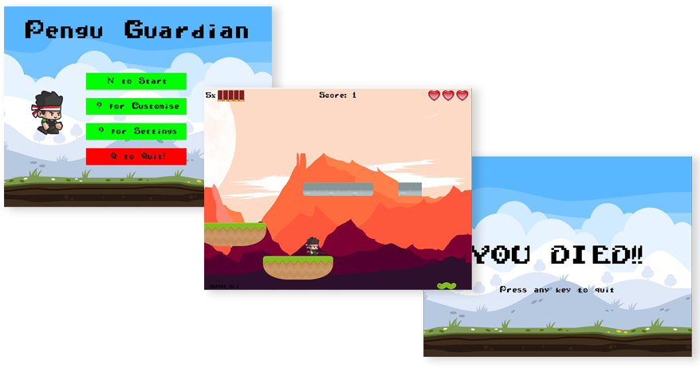

# Pengu Guardian 🐧
Pengu Guardian is a 2D platformer game created using pygame

**Basic Features:**
* 2D platformer
* Health System
* Power Ups (coming soon)
* Enemies
* Score tracking
* Boss fights (coming soon)
* Currency - Economy System (coming soon)
* Cosmetic items (coming soon)
* Multiplayer Mode (coming soon)

**Current State**

**Promotional Video**

Click the image below to watch:

**Controls:**

*Keyboard*

- WASD = movement
- Arrow keys = movement
- Spacebar = shoot
- R = reload
- F = interact (coming soon)
- V = melee attack (coming soon)
- G = grenade (coming soon)

*Controller*

_If you are using an OEM controller please run the **joysticktest.py** first to determine the buttons of your joystick, then change them accordingly on the constants.py file._
